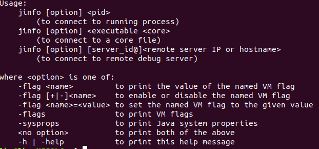

## JDK命令行工具-jinfo

jinfo的作用是实时的查看和调整虚拟机各项参数。

用法：

| 命令                                                         | 作用              |
| ------------------------------------------------------------ | ----------------- |
| jinfo \[option] \<pid\>                                      | 分析pid           |
| jinfo \[option] \<executable \<core\>                        | 分析core dump文件 |
| jinfo \[option\] \[server_id@\] \<remote server IP or hostname\> | 分析远程进程      |

option为以下之一：

| 选项                     | 作用                       |
| ------------------------ | -------------------------- |
| -flag \<name\>           | 输出对应名称的参数         |
| -flag [+\|-] \<name\>    | 开启或者关闭对应名称的参数 |
| -flag \<name\>=\<value\> | 设定对应名称的参数         |
| -flags                   | 输出全部的参数             |
| -sysprops                | 输出系统属性               |