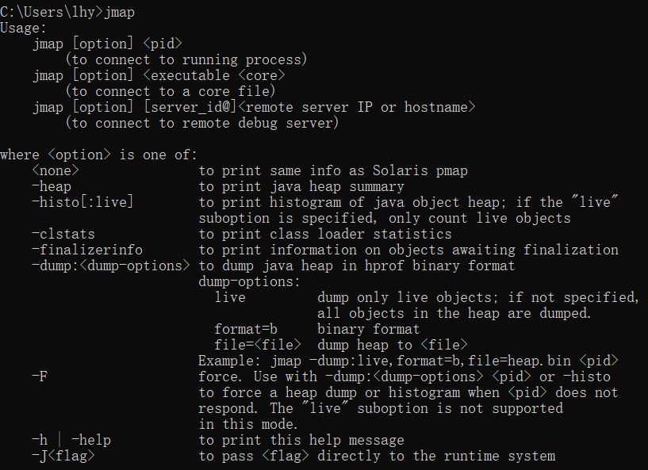
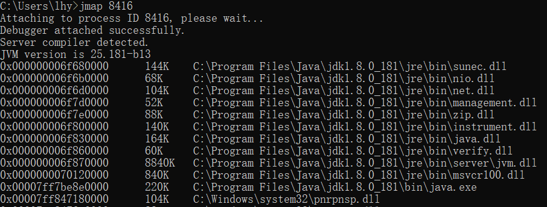
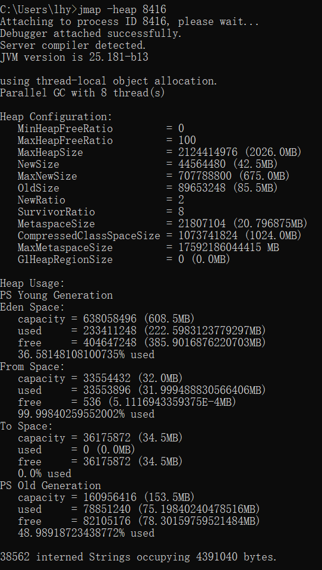
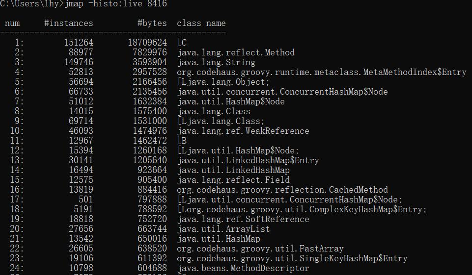
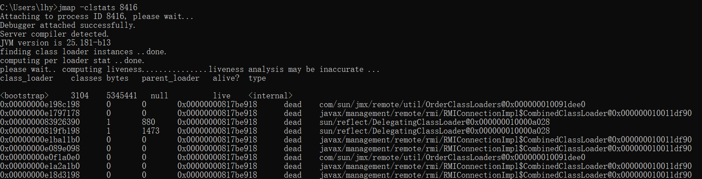
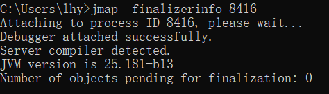
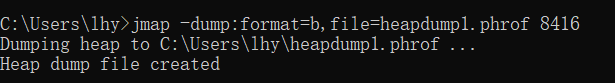

## JDK命令行工具-jmap

jmap命令用于生成堆转储快照（dump文件）。另外使用-XX:+HeapDumpOnOutOfMemoryError参数，可以让虚拟机在OOM异常出现之后自动生成dump文件，通过-XX:+HeapDumpOnCtrlBreak参数则可以使用\[Ctrl\]+\[Break\]键生成dump文件。



用法： jmap \[option] \<pid\>

option为以下之一：

| 选项                   | 作用                                                         |
| ---------------------- | ------------------------------------------------------------ |
| \<none\>               | 查看进程的内存映像信息                                       |
| -heap                  | 显示Java堆的详细信息，如使用那种回收器、参数配置、分代状况等 |
| -histo \[:live\]       | 显示堆中对象统计信息，包括类、实例数量、合计容量             |
| -clstats               | 打印类加载器信息                                             |
| -finalizerinfo         | 显示在F-Queue队列等待Finalizer线程执行finalizer方法的对象    |
| -dump:\<dump-options\> | 生成Java堆转储快照。格式为：-dump:\[live,\]format=b,file=\<filename\>，其中live子参数说明是否只dump出存货的对象 |
| -F                     | 当-dump没有响应时，可使用这个选项强制生成dump快照            |
| -J\<flag\>             | 指定传递给运行jmap的JVM的参数                                |

示例：

1. ```jmap pid```

   描述：查看进程的内存映像信息,使用不带选项参数的jmap打印共享对象映射，将会打印目标虚拟机中加载的每个共享对象的起始地址、映射大小以及共享对象文件的路径全称。

   

2. ```jmap -heap pid```

   描述：显示Java堆详细信息,打印一个堆的摘要信息，包括使用的GC算法、堆配置信息和各内存区域内存使用信息

   

3. ```jmap -histo:live pid```

   描述：显示堆中对象的统计信息，其中包括每个Java类、对象数量、内存大小(单位：字节)、完全限定的类名。打印的虚拟机内部的类名称将会带有一个’*’前缀。如果指定了live子选项，则只计算活动的对象。

   

4. ```jmap -clstats pid```

   描述：-clstats是-permstat的替代方案。打印Java堆内存的永久保存区域的类加载器的智能统计信息。对于每个类加载器而言，它的名称、活跃度、地址、父类加载器、它所加载的类的数量和大小都会被打印。此外，包含的字符串数量和大小也会被打印。

   

5. ```jmap -finalizerinfo pid```

   描述：打印等待终结的对象信息。Number of objects pending for finalization: 0 说明当前F-QUEUE队列中并没有等待Fializer线程执行finalizer()。

   

6. ```jmap -dump:format=b,file=heapdump.phrof pid```

   描述：以hprof二进制格式转储Java堆到指定filename的文件中。live子选项是可选的。如果指定了live子选项，堆中只有活动的对象会被转储。

   