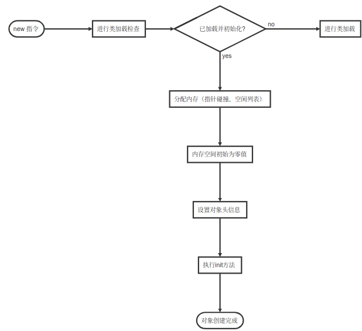

## 对象的创建过程



```flow
st=>start: new 指令
op1=>operation: 进行类加载检查
cond=>condition: 已加载并初始化?
op2=>operation: 进行类加载
op3=>operation: 分配内存（指针碰撞、空闲列表）
op4=>operation: 内存空间初始为零值
op5=>operation: 设置对象头信息
op6=>operation: 执行init方法
e=>end: 对象创建完成
st->op1->cond
cond(yes)->op3->op4->op5->op6->e
cond(no)->op2
```


