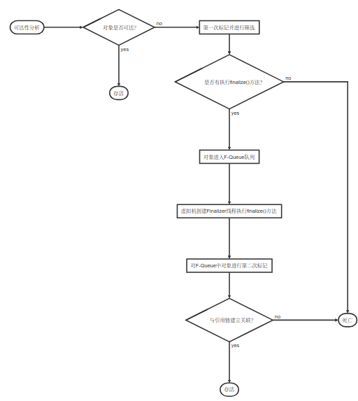

## 对象的死亡



```flow
st=>start: 可达性分析
cond1=>condition: 对象是否可达？
op1=>operation: 第一次标记并进行筛选
cond2=>condition: 是否有执行finalize()方法？
op2=>operation: 对象进入F-Queue队列
op3=>operation: 虚拟机创建Finalizer线程执行finalize()方法
op4=>operation: 对F-Queue中对象进行第二次标记
cond3=>condition: 与引用链建立关联？
e1=>end: 存活
e2=>end: 死亡
e3=>end: 存活
st->cond1
cond1(no)->op1->cond2
cond2(yes)->op2->op3->op4->cond3
cond3(yes)->e3
cond3(no)->e2
cond2(no)->e2
cond1(yes)->e1

```

+ 对象没有覆盖finalize()方法或者finalize()方法已被虚拟机调用过，虚拟机将认为这两种情况为“没有必要执行”。
+ 任何一个对象的finalize()方法只会被系统自动调用一次。
+ finalize()方法运行代价高，不确定性大，无法保证各个对象的调用顺序。
